<div align="center">
  
</div>

<div align="center">
  <a href="https://linkedin.com/in/gowthum-vijaay-d" target="_blank">
    
  </a>
</div>

<br>

<div align="center">
  <h3>🏆 National Hackathon Winner | 🥇 IMO & ISO Double Gold Medalist</h3>
  <h3>🤖 Building Autonomous AI for Real-World Impact</h3>
</div>

---

### ⚡ Who Am I?

```python
class GowthumVijaay:
    def __init__(self):
        self.name     = "Gowthum Vijaay D"
        self.alias    = "The Mighty 007"
        self.location = "Chennai, India IN"
        
    def education(self):
        return [
            "B.S. Data Science & AI @ IIT Madras 🎓",
            "B.E. EEE @ Panimalar Engineering College 🎓"
        ]

    def executive_leadership(self):
        return {
            "Role": "Assistant Vice President of Membership @ Chennai Toastmasters Club",
            "Impact": "Orchestrated end-to-end membership lifecycle (recruitment, onboarding, retention) for a 30+ member chapter. Crafted strategic communications and led executive coaching."
        }

    def current_grind(self):
        return [
            "🧠 Engineering Multi-Agent RL Systems & Autonomous Agentic Workflows",
            "🌐 Crafting mind-bending 3D WebGL experiences",
            "♟️ Dominating the chessboard (Top 0.5% Globally on Chess.com)"
        ]

    def get_mission(self):
        return "Operating at the bleeding-edge intersection of AI Systems Research and Full-Stack Architecture to build production-grade intelligence."
```

---

### 🏆 Hall of Fame

| 🏆 Meta x Scaler Hackathon | 🥇 Math Olympiad (IMO) | 🥇 Science Olympiad (ISO) | ♟️ Chess.com |
| :---: | :---: | :---: | :---: |
| **Top 800 Globally**<br>(out of 51k+ teams) | **Gold Medalist**<br>International Math Olympiad | **Gold Medalist**<br>International Science Olympiad | **Top 0.5% Globally**<br>1900 Elo |
| *RL Trading Environment* | *Global Mathematical Rigor* | *Global Scientific Inquiry* | *Strategic Mastermind* |

---

### 🚀 Flagship Project — SAGIS AI

<div align="center">
  
  
</div>

> **Proactive Risk Intelligence Platform & Neural Risk Engine**
> 
> - **Architecture:** Full-stack agentic system utilizing a Groq-accelerated Llama-3.3 70B model.
> - **Capabilities:** Computes real-time "Risk Entropy" scores and generates zero-latency interventions.
> - **Stack:** React, FastAPI, Scikit-Learn, Llama-3.3, Groq, Agentic Workflows.

---

### 💼 Experience Timeline

| Organization | Role | What I Built |
|---|---|---|
| **Freelance** | 3D Web & AI Architect | End-to-End Product Ownership: building 3D web experiences (Spline, WebGL) and integrating custom LLM features for clients. |
| **Chennai Toastmasters** | Assistant VP of Membership | Held a formal officer role managing the full membership lifecycle (recruitment, onboarding, engagement, retention), delivering structured speeches, and coordinating cross-functional collaboration. |

---

### 🛠 Tech Arsenal

<details open>
  <summary><b>🤖 Agentic AI & Machine Learning</b></summary>
  <br/>
  
  
  
  
  
  
  
</details>

<details open>
  <summary><b>🌌 Frontend & 3D Web</b></summary>
  <br/>
  
  
  
  
</details>

<details>
  <summary><b>⚙️ Backend, DevOps & Data</b></summary>
  <br/>
  
  
  
  
  
</details>

---

### 🔮 Current Quests & Focus

<table width="100%">
  <tr>
    <td width="50%" valign="top">
      <h4>🎯 Active Research Areas</h4>
      <ul>
        <li><b>Cognitive Architectures:</b> Building self-correcting agent loops.</li>
        <li><b>Unsloth Fine-tuning:</b> Low-latency specialized model fine-tunes.</li>
        <li><b>3D Web Orchestration:</b> Merging WebGL and generative AI state machines.</li>
      </ul>
    </td>
    <td width="50%" valign="top">
      <h4>🧩 Strategic Milestones</h4>
      <ul>
        <li><b>Olympiad Double Gold:</b> IMO & ISO Gold medals.</li>
        <li><b>Chess Mastery:</b> 1900 ELO (Top 0.5% globally).</li>
        <li><b>Toastmasters:</b> Crafting and leading executive communication strategies.</li>
      </ul>
    </td>
  </tr>
</table>

---

<div align="center">
  <p><b>⚡ Always building. Always shipping. Ready to join forces with the best. ⚡</b></p>
  <i>"The only way to predict the future is to build it."</i>
</div>
